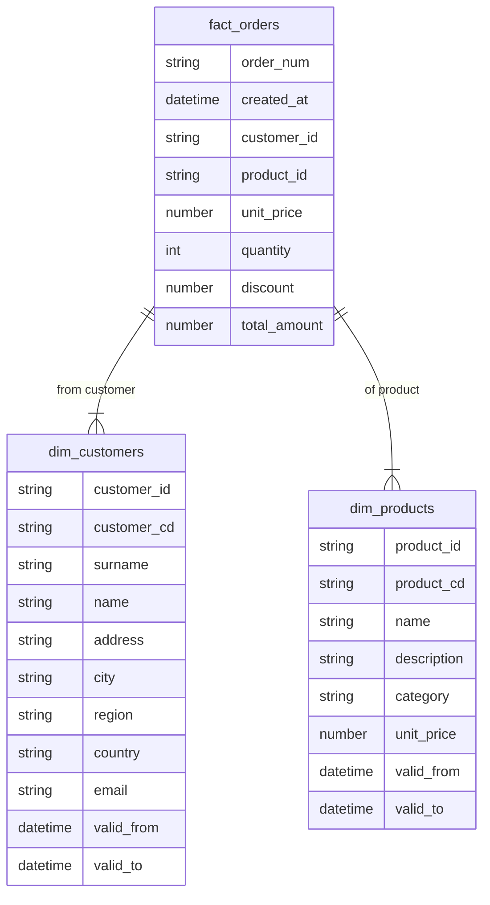

# dbt-ecommerce-dwh

## DWH ER model


## Static solution diagram:


## Development

### Local environment setup (on Ubuntu)

**Prerequisite** Make sure you have python3.8 intalled on your system

In a command shell, execute the following command in the root directory of the project:
```bash
python3.8 -m venv .venv

source .venv/bin/activate

pip install --upgrade pip
pip install -r requirements.txt
```

Up to this point, dbt has been installed and is available as "dbt" from the command line.

### Instruct dbt to install its dependencies (see file packages.yml)
```
dbt deps
```

## Running and testing the transformations
```bash
dbt run-operation stage_external_sources && \
    dbt snapshot && \
    dbt run \
    dbt test
```