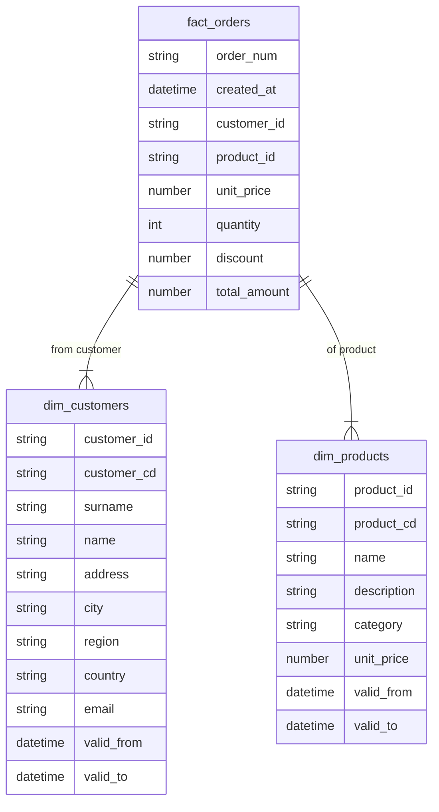

# dbt-ecommerce-dwh

## Dimensional model
(sudo docker stop dbt || exit 0) && \
(sudo docker rm dbt || exit 0) \
sudo docker run -t -d --name dbt dbt-ecommerce-dwh:latest

sudo docker exec -it dbt /bin/bash

## DWH ER model


## Static solution diagram:


## How to prepare your virtual environment to make sure you are working with python >= 3.8

(Make sure you have python3.8 intalled on your system)
```bash
python3.8 -m venv .venv

source .venv/bin/activate

pip install --upgrade pip

pip install --upgrade setuptools
pip install --upgrade wheel

```

## Install dbt and other dependencies (see requirements.txt)
```bash
pip install -r requirements.txt
```

## Make dbt install its own deps (see file packages.yml)
```
dbt deps
```

## Create external tables
```bash
dbt run-operation stage_external_sources
```

## Command to put in container
```bash
dbt run-operation stage_external_sources && \
    dbt snapshot && \
    dbt run \
    dbt test
```